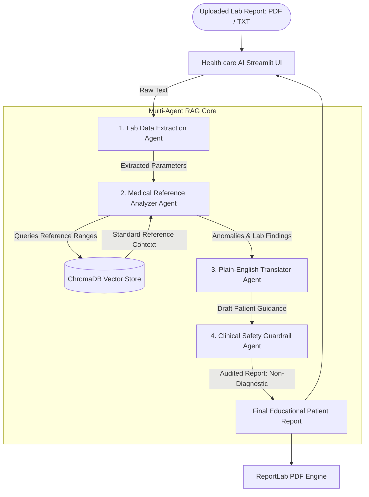

# ❤️ Health care AI — General Lab Report Interpreter & Educator

**Health care AI** is an intelligent, multi-agent medical assistance system that translates complex clinical lab reports (PDF and TXT formats) into clear, compassionate, patient-friendly health guidance. Built with a **Multi-Agent RAG (Retrieval-Augmented Generation)** architecture using **CrewAI**, **ChromaDB**, and **Streamlit**, Health care AI empowers patients to understand their lab results without medical jargon while strictly enforcing safety guardrails against rendering automated diagnoses.

---

## 🌟 Key System Features

* 📄 **Universal Lab Report File Extractor**: Accepts PDF and TXT laboratory files (lipid panels, CBC, blood glucose, kidney/liver markers, thyroid panels) and extracts raw clinical values.
* 📚 **ChromaDB Vector Store RAG Pipeline**: Queries standard medical reference guidelines stored in ChromaDB using local ONNX embeddings (`ONNXMiniLM_L6_V2`) to identify out-of-range lab metrics.
* 🤖 **4-Agent Sequential CrewAI Orchestration**: Employs four specialized AI agents communicating in a structured pipeline.
* 🛡️ **Clinical Guardrail & Non-Diagnostic Safety**: Audits output to ensure **NO medical diagnosis is made**, strictly providing educational summaries and recommending direct doctor consultation.
* 🎨 **Neon Mint Green & Cyan Gradient UI**: High-end Streamlit web dashboard with glassmorphism aesthetics and interactive modal report popups (`st.dialog`).
* 📥 **Physician-Grade PDF Report Generator**: Generates formatted, downloadable PDF summaries using ReportLab.

---

## 🏗️ Multi-Agent Architecture



### Specialized Agent Roles & Responsibilities

| Agent Role | Model Provider | Key Responsibility |
| :--- | :--- | :--- |
| **1. Lab Data Extraction Agent** | `groq/llama-3.1-8b-instant` | Parses uploaded PDF/TXT files and structures raw numerical lab metrics, parameter names, and units. |
| **2. Medical Reference Analyzer Agent** | `openrouter/google/gemma-4-26b-a4b-it:free` | Queries ChromaDB RAG vector store for clinical reference ranges and categorizes parameters (normal, borderline, high, low). |
| **3. Plain-English Translator Agent** | `openrouter/google/gemma-4-26b-a4b-it:free` | Translates technical lab findings into clear, compassionate 4-section patient guidance without clinical jargon. |
| **4. Clinical Safety Guardrail Agent** | `groq/llama-3.1-8b-instant` | Audits the final draft report to strictly enforce that **NO medical diagnosis is rendered** and directs doctor consultation. |

---

## 📚 RAG Knowledge Base Pipeline

The RAG pipeline is powered by **ChromaDB** and `medical_corpus.txt`, containing standard clinical reference ranges for:
- **Lipid Panels**: Total Cholesterol, LDL, HDL, Triglycerides.
- **Glycemic Markers**: Fasting Blood Glucose, Hemoglobin A1c (HbA1c).
- **Complete Blood Count (CBC)**: Hemoglobin, White Blood Cell Count (WBC), Platelet Count.
- **Renal & Hepatic Panels**: Serum Creatinine, Blood Urea Nitrogen (BUN), ALT, AST.
- **Thyroid Function**: Thyroid Stimulating Hormone (TSH).

### Ingestion Execution:
```bash
python rag_setup.py
```
This script embeds `medical_corpus.txt` using `ONNXMiniLM_L6_V2` into a persistent ChromaDB vector database located in `.chroma/`.

---

## 🌿 Git Branching Strategy

Our development repository strictly enforces feature branching aligned with university guidelines:

1. `feature/ui-generalization` — Streamlit UI cleanup, rebranding to Health care AI, and neon mint green/cyan gradient glassmorphism styling.
2. `feature/file-extraction` — PDF (`pypdf`) and TXT raw text parsing helper functions (`tools.py`).
3. `feature/rag-knowledge-base` — ChromaDB vector store initialization and reference range ingestion (`rag_setup.py`).
4. `feature/multi-agent-orchestration` — CrewAI 4-Agent sequential workflow (`agents/` & `crew_logic.py`).
5. `feature/guardrails-and-safety` — Clinical safety reviewer auditing non-diagnostic constraints.
6. `docs/readme-overhaul` — Project documentation and architecture specification.

---

## 🚀 Quickstart & Setup Guide

### 1. Clone & Prerequisites
```bash
git clone https://github.com/AnjanaMadhushanaj/Heart_Agent_App.git
cd Heart_Agent_App
```

### 2. Install Dependencies
```bash
pip install -r requirements.txt
```

### 3. Configure API Keys (`.env`)
Create a `.env` file in the root directory:
```env
GROQ_API_KEY=your_groq_api_key_here
OPENROUTER_API_KEY=your_openrouter_api_key_here
```

### 4. Initialize RAG Vector Store
```bash
python rag_setup.py
```

### 5. Launch Application
```bash
streamlit run app.py
```

---

## 🛡️ Medical Disclaimer
*Health care AI is an educational technology demonstration. It provides general educational explanations of medical laboratory reference ranges and does NOT provide medical advice, diagnosis, or treatment. Patients must always consult a qualified healthcare professional regarding any medical condition or lab result.*
