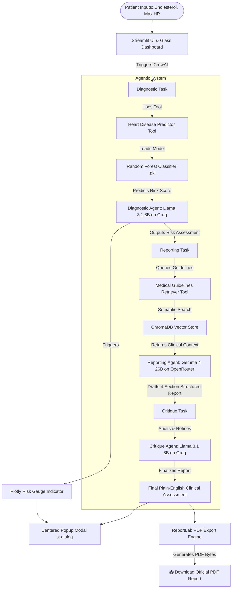

# CardioCare AI: Clinical Decision Support System (CDSS)

An Agentic Clinical Decision Support System designed for the Horizon Campus module **IT41043 — Intelligent Systems (Agentic AI)**. This system combines machine learning risk prediction with a Retrieval-Augmented Generation (RAG) medical knowledge base, a multi-agent reflection loop, interactive Plotly diagnostic gauge visualization, and automated PDF clinical report export to deliver safe, empathetic, and evidence-guided healthcare intelligence.

---

## 🌟 Key Features

- **Predictive ML Risk Analytics**: Employs a pre-trained Random Forest Classifier (`heart_disease_optimized_model.pkl`) to assess patient risk from raw vitals (`Total Cholesterol` & `Max Exercise Heart Rate`).
- **Cardiology RAG Pipeline**: Grounded on a local ChromaDB vector store loaded with 20+ peer-reviewed cardiology guidelines and clinical protocols.
- **Multi-Agent Orchestration & Reflection**: Combines diagnostic, reporting, and critique agents (`CrewAI`) utilizing high-speed LLM model routing (`Llama 3.1 8B Instant` on Groq & `Gemma 4 26B Instruct` on OpenRouter).
- **Interactive Plotly Risk Gauge Score**: Visual gauge indicator (`plotly.graph_objects.Indicator`) displaying patient risk level immediately upon analysis.
- **Centered Assessment Report Modal Dialog**: Interactive popup modal (`st.dialog`) displaying patient vitals, diagnostic risk level, gauge score, and full structured clinical assessment.
- **Official Physician-Grade PDF Export**: Built-in PDF report generation engine (`reportlab`) allowing patients and clinicians to download formal PDF assessment reports with one click.
- **Premium Glassmorphic UI Aesthetics**: Modern Streamlit interface utilizing dark glass containers, vibrant neon mint green accents (`#00e676`), and symmetrical side-by-side action buttons.

---

## 🏛️ System Architecture

The following diagram illustrates the flow of patient data through the system, highlighting the ML predictions, ChromaDB RAG lookup, multi-agent reflection process, Plotly gauge score rendering, and ReportLab PDF document export.



---

## 🤖 Agentic Design Patterns

This application implements three distinct agentic design patterns, satisfying the mandatory rubric criteria:

| Design Pattern | Implementation Location | Rationale & Description |
| :--- | :--- | :--- |
| **1. Tool-Use** | [tools.py](file:///d:/My/My%20Projects/Agentic_Health_System/tools.py) & [agents.py](file:///d:/My/My%20Projects/Agentic_Health_System/agents.py#L20) | The **Diagnostic Agent** is equipped with a custom Python tool that loads a serialized Random Forest model (`heart_disease_optimized_model.pkl`) to execute scientific data classification instead of relying on LLM arithmetic guessing. |
| **2. RAG / Retrieval** | [rag_setup.py](file:///d:/My/My%20Projects/Agentic_Health_System/rag_setup.py) & [agents.py](file:///d:/My/My%20Projects/Agentic_Health_System/agents.py#L35) | The **Reporting Agent** leverages a custom vector store retriever tool to query ChromaDB for peer-reviewed cardiology guidelines. This guarantees that clinical reports are strictly grounded in WHO and cardiological standards, preventing hallucinations. |
| **3. Reflection / Self-Critique** | [crew_logic.py](file:///d:/My/My%20Projects/Agentic_Health_System/crew_logic.py#L32) & [agents.py](file:///d:/My/My%20Projects/Agentic_Health_System/agents.py#L50) | The **Critique Agent** acts as an internal medical auditor. It reviews the draft report generated by the Reporting Agent, checks it against safety constraints (ensuring it is non-alarmist, contains actionable lifestyle advice, and maintains 4-section structural guidelines), and outputs a polished final draft. |

---

## 📊 Model Selection Strategy

To optimize latency, cost, and reasoning capacity, we deliberately employ a dual-provider model selection strategy:

| Sub-task | Model (Provider) | Why Chosen |
| :--- | :--- | :--- |
| **Tabular ML Risk Assessment** | `Llama 3.1 8B Instant` (Groq) | **Ultra-Low Latency & High Speed**: The Diagnostic Agent invokes the ML model tool and summarizes its output. Llama 3.1 8B on Groq offers near-zero latency and high token limits (30,000 TPM). |
| **Evidence Synthesis & Report Generation** | `Gemma 4 26B Instruct` (OpenRouter) | **High Reasoning Quality & Empathy**: The Reporting Agent synthesizes numerical data, model classifications, and semantic guidelines into a compassionate 4-section narrative. Gemma 4 26B provides superior medical writing quality and safety compliance. |
| **Report Audit / Self-Critique** | `Llama 3.1 8B Instant` (Groq) | **Refined Verification**: Auditing the report structure and checking safety rules is a straightforward task. Llama 3.1 8B handles this audit instantly. |

---

## 🗂️ RAG Integration & Evaluation

### Chunking & Embedding Details
- **Corpus**: Located in [medical_corpus.txt](file:///d:/My/My%20Projects/Agentic_Health_System/medical_corpus.txt) containing 22 distinct clinical guidelines.
- **Chunking Strategy**: Line-by-line document split. Each line acts as a stand-alone semantic rule (e.g., target heart rate formulas, cholesterol thresholds, sodium guidelines).
- **Embedding Model**: Local ONNX MiniLM (`all-MiniLM-L6-v2` running via `onnxruntime`). Runs offline with zero cost, zero latency, and zero remote API dependencies.
- **Vector Store**: Local `ChromaDB` persistent vector database client.

---

## 📄 Official PDF Export Feature

The application includes an integrated ReportLab PDF generation engine ([pdf_generator.py](file:///d:/My/My%20Projects/Agentic_Health_System/pdf_generator.py)):
- **Custom Document Layout**: Header banner, patient clinical metrics summary table, diagnostic risk classification badge, and structured clinical advice.
- **One-Click Download**: Embedded directly inside the Streamlit Report Modal and Dashboard via `st.download_button`.

---

## ⚙️ Setup & Installation

### Prerequisites
- Python 3.10 to 3.12.
- Git.

### Setup Instructions

1. **Clone the Repository**:
   ```bash
   git clone https://github.com/AnjanaMadhushanaj/Heart_Agent_App.git
   cd Heart_Agent_App
   ```

2. **Set up Environment Variables**:
   Create a `.env` file in the root directory:
   ```env
   GROQ_API_KEY=gsk_your_groq_api_key_here
   OPENROUTER_API_KEY=sk-or-v1-your_openrouter_api_key_here
   ```

3. **Install Dependencies**:
   ```bash
   pip install -r requirements.txt
   ```

4. **Initialize ChromaDB RAG Store**:
   Ingest medical guidelines into ChromaDB:
   ```bash
   python rag_setup.py
   ```

5. **Run Verification Tests**:
   Verify ML predictions, ChromaDB retrieval, report generation, and PDF export by running:
   ```bash
   python test_model.py
   python test_rag.py
   python test_report.py
   python test_pdf.py
   ```

6. **Run the Streamlit Web Application**:
   ```bash
   streamlit run app.py
   ```

---

## 👥 Authors & License
Developed for **IT41043 — Intelligent Systems (Agentic AI)** | Horizon Campus.
