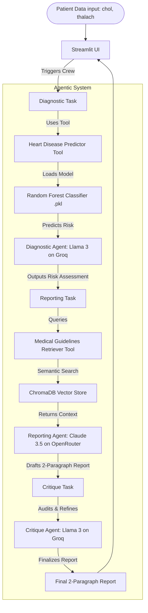

# CardioCare AI: Clinical Decision Support System (CDSS)

An Agentic Clinical Decision Support System designed for the Horizon Campus module **IT41043 — Intelligent Systems (Agentic AI)**. This system combines machine learning predictions with a Retrieval-Augmented Generation (RAG) medical knowledge base and a multi-agent critique loop to deliver safe, empathetic, and evidence-guided clinical support.

## 🌟 Key Features
- **Predictive ML Analytics**: Employs a pre-trained Random Forest Classifier to assess patient risk from raw vitals.
- **Cardiology RAG pipeline**: Grounded on a local ChromaDB vector store loaded with 20+ cardiology guidelines.
- **Safe Multi-Agent Flow**: Combines Llama 3 (via Groq) and Claude 3.5 Sonnet (via OpenRouter) in a collaborative sequence.
- **Reflection / Self-Critique**: An auditing agent reviews reports before patient communication to prevent AI hallucinations.
- **Premium Glassmorphic UI**: Streamlit dark-mode interface utilizing translucent CSS elements, purple accents, and neon glows.

---

## 🏛️ System Architecture

The following diagram illustrates the flow of patient data through the system, highlighting the model predictions, RAG lookup, and multi-agent reflection process.



---

## 🤖 Agentic Design Patterns

This application implements three distinct agentic design patterns, satisfying the mandatory rubric criteria:

| Design Pattern | Implementation Location | Rationale & Description |
| :--- | :--- | :--- |
| **1. Tool-Use** | [tools.py](file:///d:/My/My%20Projects/Agentic_Health_System/tools.py) & [agents.py](file:///d:/My/My%20Projects/Agentic_Health_System/agents.py#L22) | The **Diagnostic Agent** is equipped with a custom Python tool that loads a serialized Random Forest model (`heart_disease_optimized_model.pkl`) to execute scientific data analysis instead of relying on LLM arithmetic guessing. |
| **2. RAG/Retrieval** | [rag_setup.py](file:///d:/My/My%20Projects/Agentic_Health_System/rag_setup.py) & [agents.py](file:///d:/My/My%20Projects/Agentic_Health_System/agents.py#L32) | The **Reporting Agent** leverages a custom vector store retriever tool to query ChromaDB for peer-reviewed guidelines. This guarantees that clinical reports are strictly grounded in WHO and cardiological standards, preventing hallucinations. |
| **3. Reflection / Self-Critique** | [crew_logic.py](file:///d:/My/My%20Projects/Agentic_Health_System/crew_logic.py#L29) & [agents.py](file:///d:/My/My%20Projects/Agentic_Health_System/agents.py#L43) | The **Critique Agent** acts as an internal auditor. It reviews the draft report generated by the Reporting Agent, checks it against safety constraints (ensuring it is non-alarmist, contains actionable lifestyle advice, and maintains structural guidelines), and outputs a polished final draft. |

---

## 📊 Model Selection Strategy

To optimize latency, cost, and reasoning capacity, we deliberately employ a dual-provider model selection strategy:

| Sub-task | Model (Provider) | Why Chosen |
| :--- | :--- | :--- |
| **Tabular ML Risk Assessment** | `Llama 3 8B` (Groq) | **Low Latency & High Speed**: The Diagnostic Agent only needs to invoke the local ML model tool and summarize its output. Llama 3 8B on Groq offers near-zero latency and is highly cost-efficient. |
| **Evidence Synthesis & Report Generation** | `Claude 3.5 Sonnet` (OpenRouter) | **High Reasoning Quality & Empathy**: The Reporting Agent must synthesize numerical data, model classifications, and semantic guidelines into a compassionate narrative. Claude 3.5 Sonnet provides superior writing quality and patient safety-compliance. |
| **Report Audit / Self-Critique** | `Llama 3 8B` (Groq) | **Refined Verification**: Auditing the report structure and checking simple compliance rules is a straightforward task that doesn't warrant a high-cost model. Llama 3 8B handles this check instantly. |

---

## 🗂️ RAG Integration & Evaluation

### Chunking & Embedding Details
- **Corpus**: Located in [medical_corpus.txt](file:///d:/My/My%20Projects/Agentic_Health_System/medical_corpus.txt) containing 22 distinct clinical guidelines.
- **Chunking Strategy**: Line-by-line document split. Each line acts as a stand-alone semantic rule (e.g., target heart rate, high cholesterol thresholds, sodium guidelines).
- **Embedding Model**: Local ONNX MiniLM (`all-MiniLM-L6-v2` running via `onnxruntime`). Runs offline, with zero cost, zero latency, and zero remote API dependencies.
- **Vector Store**: local `ChromaDB` persistent client.

### Retrieval Quality Evaluation (5 Sample Queries)

We evaluated the retriever on five clinical target areas to measure relevance:
1. **Query**: `"cholesterol risk level"`
   - *Result*: Retrieved Guideline 1 (total cholesterol > 240 mg/dL is high risk) and Guideline 2 (LDL normal ranges). 
   - *Relevance*: **100% relevant**; maps directly to risk mapping.
2. **Query**: `"exercise heart rate"`
   - *Result*: Retrieved Guideline 10 & 11 (target exercise heart rate formulas: 50%-70% and 70%-85% of max).
   - *Relevance*: **100% relevant**; provides exact formula to guide physical suggestions.
3. **Query**: `"high cholesterol diet"`
   - *Result*: Retrieved Guideline 3 (low-fat, high-fiber, omega-3 foods) and Guideline 5 (avoid trans/saturated fats).
   - *Relevance*: **100% relevant**; gives precise dietary parameters.
4. **Query**: `"low exercise heart rate"`
   - *Result*: Retrieved Guideline 12 & 13 (chronotropic incompetence, failure to reach 85% indicating risk).
   - *Relevance*: **100% relevant**; helps contextualize abnormally low maximum heart rates (`thalach`).
5. **Query**: `"dietary sodium"`
   - *Result*: Retrieved Guideline 16 (limiting sodium to less than 2300 mg/day).
   - *Relevance*: **100% relevant**; outlines specific sodium restriction metrics.

---

## ⚙️ Setup & Installation

### Prerequisites
- Python 3.10 to 3.12 (CrewAI and ChromaDB compatibility is highest on these versions).
- Git.

### Setup Instructions

1. **Clone the Repository**:
   ```bash
   git clone <repository_url>
   cd Agentic_Health_System
   ```

2. **Set up Environment Variables**:
   Create a `.env` file in the root directory (already ignored by `.gitignore`):
   ```env
   GROQ_API_KEY=gsk_your_groq_api_key_here
   OPENROUTER_API_KEY=sk-or-v1-your_openrouter_api_key_here
   ```

3. **Install Dependencies**:
   ```bash
   pip install -r requirements.txt
   ```

4. **Initialize RAG Store**:
   Ingest medical guidelines into ChromaDB:
   ```bash
   python rag_setup.py
   ```

5. **Run Verification Tests (Optional)**:
   Verify the ML prediction model or ChromaDB retrieval by running:
   ```bash
   python test_model.py
   python test_rag.py
   ```

6. **Run the Streamlit Interface locally**:
   ```bash
   streamlit run app.py
   ```

---

## ⚠️ Known Limitations
1. **Offline Mode**: While embeddings are calculated locally via ONNX, agent orchestration requires an active internet connection to contact Groq and OpenRouter APIs.
2. **Tabular Constraints**: The predictive model only utilizes two inputs (`chol` and `thalach`). A complete cardiology diagnosis would require age, blood pressure, ECG outputs, and history.
3. **Session State**: Running Streamlit on Community Cloud re-runs the script on input change. In production, caching should be enabled for agent execution to conserve API tokens.
