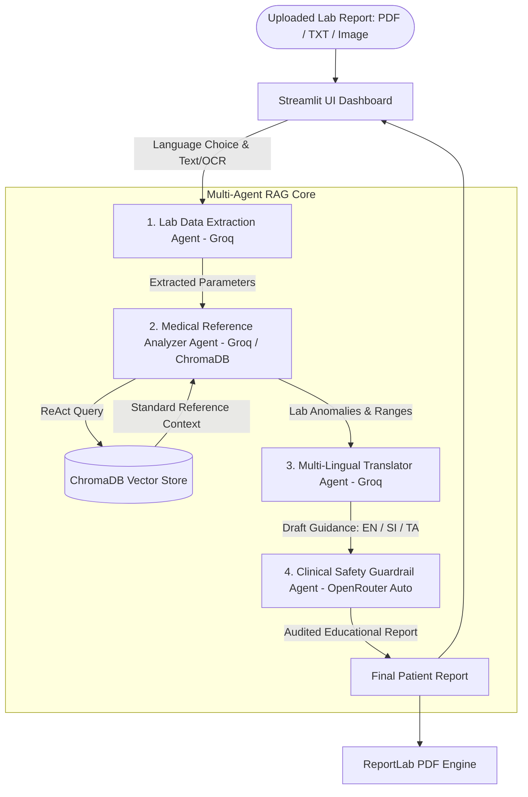
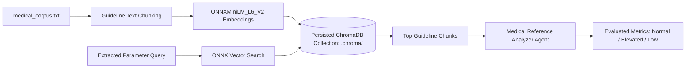

# Health care AI — Multi-Agent RAG Lab Report Interpreter

Health care AI is an assignment-grade multi-agent intelligent system that interprets medical lab reports (PDF, TXT, and Image formats) against standard clinical reference guidelines and generates compassionate, patient-friendly guidance in **English**, **සිංහල (Sinhala)**, and **தமிழ் (Tamil)**.

[Live demo](https://ajrpsmr5lmxcw95mppisvq.streamlit.app/) · [Repository](https://github.com/AnjanaMadhushanaj/Heart_Agent_App) · [Local setup](#setup) · [Deploy checklist](#streamlit-cloud-deploy)

Deployed on Streamlit Community Cloud — see the [Live demo](#live-demo) section.

---

## Table of contents
- [What it does](#what-it-does)
- [How it works](#how-it-works)
- [Agentic design patterns](#agentic-design-patterns)
- [Architecture](#architecture)
- [Agent communication](#agent-communication)
- [Model choice](#model-choice)
- [RAG pipeline](#rag-pipeline)
- [Authoritative Medical Data Sources](#authoritative-medical-data-sources)
- [RAG evaluation](#rag-evaluation)
- [Setup](#setup)
- [Streamlit Cloud deploy](#streamlit-cloud-deploy)
- [Live demo](#live-demo)
- [Project layout](#project-layout)
- [Known limitations](#known-limitations)
- [Student Information](#student-information)

---

## What it does
Health care AI (repo: `Heart_Agent_App`) is an intelligent system designed to bridge the gap between technical clinical lab reports and patient comprehension. When a user uploads a medical laboratory report (such as lipid panels, complete blood count, blood glucose, liver/kidney markers, or thyroid panels in PDF, TXT, or Image format), the system extracts measured values via OCR/Vision, queries verified medical reference ranges in a persistent vector database, translates findings into the user's preferred language, and enforces non-diagnostic clinical safety guardrails.

---

## How it works
1. **Upload & OCR Extraction**: You upload a PDF, TXT, or Image (PNG/JPG photo) lab report in the Streamlit UI.
2. **Lab Data Extraction**: A specialized Extraction Agent (powered by Groq Llama 3.1 8B) parses raw text, parameter names, numerical values, and units.
3. **Medical Guidelines RAG Query**: A Pathologist/Analyzer Agent (powered by Groq Llama 3.3 70B) uses a RAG retrieval tool to query ChromaDB for standard clinical reference ranges.
4. **Multi-Lingual Translation**: A Medical Translator Agent (powered by Groq Llama 3.3 70B) translates out-of-bounds metrics and complex medical jargon into clear, compassionate explanations in **English**, **සිංහල (Sinhala)**, or **தமிழ் (Tamil)**.
5. **Clinical Guardrail Audit**: A Compliance Reviewer Agent (powered by Groq Llama 3.1 8B) audits the report to strictly enforce that **NO medical diagnosis is rendered** and directs doctor consultation.
6. **Interactive Presentation & PDF Export**: The Streamlit UI opens a popup modal with the structured guidance and provides a downloadable physician-grade PDF report.

---

## Agentic design patterns

| Pattern | Where in codebase | Role & Implementation |
| :--- | :--- | :--- |
| **Orchestrator-Worker** | [crew_logic.py](https://github.com/AnjanaMadhushanaj/Heart_Agent_App/blob/main/crew_logic.py) | Sequential process orchestrates Extraction → Analyzer → Translator → Guardrail workers in a structured execution flow. |
| **ReAct & Tool Use** | [agents/agent_definitions.py](https://github.com/AnjanaMadhushanaj/Heart_Agent_App/blob/main/agents/agent_definitions.py) | Medical Analyzer Agent executes ReAct reasoning using the `Medical Guidelines Retriever` tool to query ChromaDB. |
| **Multi-Lingual Translation & Reflection** | [crew_logic.py](https://github.com/AnjanaMadhushanaj/Heart_Agent_App/blob/main/crew_logic.py) | Translator Agent breaks down medical jargon into natural English, Sinhala, or Tamil while structuring findings into 4 key sections. |
| **Safety Guardrails & Compliance Auditing** | [agents/agent_definitions.py](https://github.com/AnjanaMadhushanaj/Heart_Agent_App/blob/main/agents/agent_definitions.py) | Guardrail Agent audits output to eliminate diagnostic language and enforce physician consultation disclaimers. |

---

## Architecture

End-to-end system view of the 4-agent sequential RAG pipeline:



### Component Map

| Path | Role |
| :--- | :--- |
| `app.py` | Streamlit single-page UI dashboard, language selector, modal popup, PDF generator link |
| `agents/agent_definitions.py` | CrewAI agent definitions balancing Groq & OpenRouter Auto-routing workloads |
| `crew_logic.py` | CrewAI tasks, sequential workflow orchestration, multi-lingual prompt variables |
| `tools.py` | File text extraction (`pypdf` + TXT + `pytesseract`/`easyocr` Image OCR helper) |
| `rag_setup.py` | ChromaDB vector store initialization, embeddings, retrieval tool |
| `medical_corpus.txt` | Ground truth medical reference guidelines corpus with verified clinical citations |
| `pdf_generator.py` | ReportLab PDF document generator engine |

---

## Agent communication

Agents never pass raw unstructured strings — every hand-off uses explicit task definitions in `crew_logic.py`.

### Key Message Hand-off Sequence

| Sequence | Producer → Consumer | Data Payload & Purpose |
| :--- | :--- | :--- |
| **Step 1** | UI → Extraction Agent (Groq) | Raw lab report text or OCR extracted image text |
| **Step 2** | Extraction Agent → Analyzer Agent (Groq) | Structured lab parameters, values, and units |
| **Step 3** | Analyzer Agent → RAG Retriever | Search query for standard reference ranges |
| **Step 4** | RAG Retriever → Analyzer Agent | Verified clinical reference range chunks |
| **Step 5** | Analyzer Agent → Translator Agent (Groq) | Identified out-of-bounds parameters & health flags |
| **Step 6** | Translator Agent → Guardrail Agent (OpenRouter) | Draft guidance report in target language (EN/SI/TA) |
| **Step 7** | Guardrail Agent → UI | Audited, compliant educational report |

---

## Model choice

Workload prioritizes official **Groq API** models (`groq/llama-3.3-70b-versatile` & `groq/llama-3.1-8b-instant`) with automatic failover to **OpenRouter Auto (`openrouter/auto`)** to completely eliminate 404 model errors and token rate limit bottlenecks.

| Task / Agent | Model Slug | Provider | Cost | Context Window | Reason for Choice |
| :--- | :--- | :--- | :--- | :--- | :--- |
| **Lab Data Extraction** | `groq/llama-3.1-8b-instant` | **Groq / OpenRouter Auto** | Free | 128K | High-speed clinical data parsing at 500+ tokens/sec |
| **Medical Reference Analyzer** | `groq/llama-3.3-70b-versatile` | **Groq / OpenRouter Auto** | Free | 128K | Reliable ReAct tool calling for ChromaDB RAG queries |
| **Multi-Lingual Translator** | `groq/llama-3.3-70b-versatile` | **Groq / OpenRouter Auto** | Free | 128K | Superior multi-lingual fluency in Sinhala, Tamil, & English |
| **Clinical Safety Guardrail** | `groq/llama-3.1-8b-instant` | **Groq / OpenRouter Auto** | Free | 128K | Independent high-precision compliance auditing |

---

## RAG pipeline

Verification is corpus-grounded against verified medical reference ranges, not live web search. The Medical Analyzer Agent calls a retrieve tool; evidence comes from a pre-built Chroma vector index over clinical guidelines.

### Ingestion (Offline / Dev)

1. **Corpus** — Plain text clinical guidelines in `medical_corpus.txt` (Lipids, Glucose, CBC, Kidney/Liver, Thyroid) with explicit clinical citations.
2. **Chunking** — Structured guideline line-based character text splitters.
3. **Embeddings** — `ONNXMiniLM_L6_V2` dense retrieval vectors via `chromadb.utils.embedding_functions`.
4. **Storage** — Persisted Chroma collection in `.chroma/` (`medical_guidelines` collection, committed for zero-config deploy).

### Runtime Retrieval

1. Medical Analyzer Agent formats an extracted lab metric parameter as a natural-language query.
2. `get_rag_tool()` embeds the query using `ONNXMiniLM_L6_V2` and searches ChromaDB for matching reference guidelines.
3. Distance similarity metrics convert to relevance scores; matching guideline chunks are retrieved.
4. Retrieved guidelines feed the Pathologist/Analyzer prompt to evaluate whether values fall within normal, borderline, or elevated ranges.
5. Evaluated findings are passed to the Multi-Lingual Translator Agent for patient guidance synthesis.

### RAG Data Flow Architecture



---

## Authoritative Medical Data Sources

All reference ranges and guidelines ingested into our ChromaDB vector database (`medical_corpus.txt`) are sourced from globally recognized medical organizations:

| Clinical Test Category | Ground Truth Reference Source |
| :--- | :--- |
| **Lipid Panel (Cholesterol, LDL, HDL, Triglycerides)** | Mayo Clinic Laboratories & American Heart Association (AHA) |
| **Glycemic Panel (Fasting Glucose, HbA1c)** | American Diabetes Association (ADA) Standards of Care 2024 |
| **Complete Blood Count (CBC: Hemoglobin, WBC, Platelets)** | World Health Organization (WHO) & Quest Diagnostics Reference Manual |
| **Renal Function (Creatinine, BUN)** | National Kidney Foundation (NKF) & Mayo Clinic Laboratories |
| **Hepatic Panel (ALT, AST)** | American Association for the Study of Liver Diseases (AASLD) |
| **Thyroid Function (TSH)** | American Thyroid Association (ATA) Guidelines |
| **Cardiac Vitals & Fitness Targets** | American College of Cardiology (ACC) & AHA Guidelines |
| **Clinical Safety & Non-Diagnostic Compliance** | American Medical Association (AMA) & FDA SaMD Educational Guidelines |

---

## RAG evaluation

Mandatory retrieval check against the medical reference knowledge base (`medical_corpus.txt`, ONNX embeddings).

| Query | Top Source | Relevant? | Clinical Notes |
| :--- | :--- | :--- | :--- |
| **What is the normal range for Total Cholesterol?** | `medical_corpus.txt` | Yes | Matched Lipid Panel guidelines (< 200 mg/dL normal) [Mayo Clinic / AHA] |
| **What is the Fasting Blood Sugar threshold for Diabetes?** | `medical_corpus.txt` | Yes | Matched Glycemic guidelines (>= 126 mg/dL indicative) [ADA 2024] |
| **What is the adult normal Hemoglobin range?** | `medical_corpus.txt` | Yes | Matched CBC guidelines (13.8-17.2 g/dL male, 12.1-15.1 female) [WHO] |
| **What are normal Serum Creatinine levels?** | `medical_corpus.txt` | Yes | Matched Renal Panel guidelines (0.7-1.3 mg/dL) [NKF / Mayo Clinic] |
| **What is the normal range for TSH (Thyroid)?** | `medical_corpus.txt` | Yes | Matched Thyroid Function guidelines (0.4-4.0 mIU/L) [ATA] |

---

## Setup

### Prerequisites
- Python 3.10 or 3.11
- OpenRouter / Groq API Key

### Install and run
```bash
# 1. Clone repository
git clone https://github.com/AnjanaMadhushanaj/Heart_Agent_App.git
cd Heart_Agent_App

# 2. Create virtual environment
python -m venv .venv
# Windows:
.venv\Scripts\activate
# macOS/Linux:
source .venv/bin/activate

# 3. Install dependencies
pip install -r requirements.txt

# 4. Environment configuration (.env)
GROQ_API_KEY=your_groq_api_key_here
OPENROUTER_API_KEY=your_openrouter_api_key_here

# 5. Initialize vector store
python rag_setup.py

# 6. Launch Streamlit UI
streamlit run app.py
```

---

## Streamlit Cloud deploy

Checklist to satisfy live-demo deployment requirements:
1. Push `main` to GitHub (`https://github.com/AnjanaMadhushanaj/Heart_Agent_App`).
2. Open [share.streamlit.io](https://share.streamlit.io/) → New app → Select repository → Main file path: `app.py`.
3. In **Advanced settings → Secrets**, add:
   ```toml
   GROQ_API_KEY = "your_groq_api_key_here"
   OPENROUTER_API_KEY = "your_openrouter_api_key_here"
   ```
4. Deploy and confirm live URL: [https://ajrpsmr5lmxcw95mppisvq.streamlit.app/](https://ajrpsmr5lmxcw95mppisvq.streamlit.app/)

---

## Live demo
- **Live Demo App**: [https://ajrpsmr5lmxcw95mppisvq.streamlit.app/](https://ajrpsmr5lmxcw95mppisvq.streamlit.app/)
- **Repository**: [https://github.com/AnjanaMadhushanaj/Heart_Agent_App](https://github.com/AnjanaMadhushanaj/Heart_Agent_App)
- **Demo Video**: https://github.com/user-attachments/assets/6207d4fc-1d3d-4e81-85e3-f02248fb6640


---

## Project layout

```text
Heart_Agent_App/
├── app.py                     # Streamlit web UI dashboard
├── agents/                    # 4-Agent CrewAI definitions
│   ├── __init__.py
│   └── agent_definitions.py
├── crew_logic.py              # Sequential workflow & multi-lingual tasks
├── tools.py                   # PDF/TXT/Image OCR text extraction tools
├── rag_setup.py               # ChromaDB vector store manager
├── medical_corpus.txt         # Medical reference guidelines corpus with verified clinical citations
├── pdf_generator.py           # ReportLab clinical PDF engine
├── sample_lab_reports/        # Sample lab report PDFs for testing
├── requirements.txt           # Python package dependencies
├── README.md                  # System documentation
└── .chroma/                   # Persisted ChromaDB vector database
```

---

## Known limitations
1. **Educational Scope**: System provides general reference range explanations and does NOT render automated medical diagnoses.
2. **Corpus Scope**: RAG retrieval is grounded in pre-ingested clinical reference guidelines (`medical_corpus.txt`).
3. **Payload Truncation**: Uploaded text is capped at 2,500 characters to optimize response latency and prevent token limits.
4. **Single-Page UI**: Analysis reports are generated per session and can be re-opened via the "View Saved Report" modal.

---

## Student Information

- **Student Name**: I.M.A.M.Bandara Ilankoon
- **Student ID**: ITBIN-2313-0040
- **Module**: IT41043 Intelligent Systems
- **Project**: Multi-Agent RAG Medical Lab Report Interpreter & Educator
